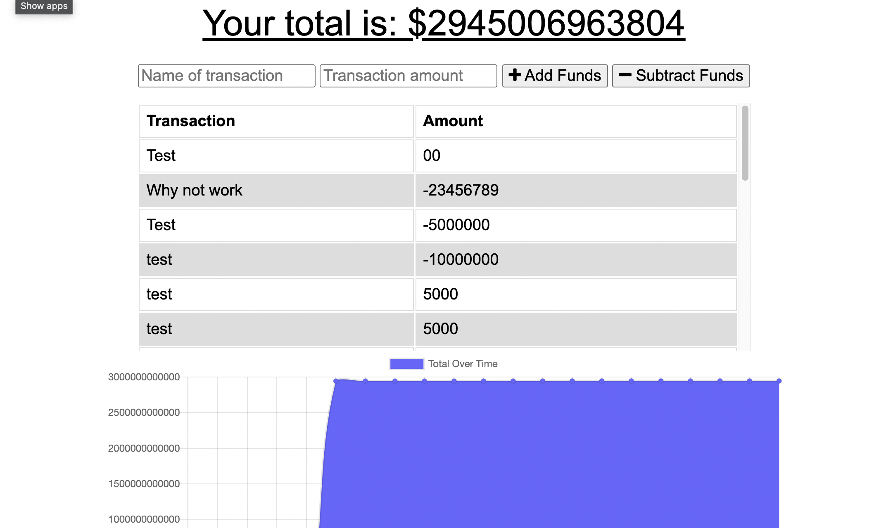

# budget_tracker

  This project was to allow changes to be saved to a budget tracker while off line.

# Attributes

  When the user adds or subtracts funds the amoutn will be shown on a graph
  When the user adds or subtracts funds while off line the changes will be update upon going online

# Links
  The deployed app can be found here:
https://murmuring-sands-62042.herokuapp.com/

# Technologies

  JavaScript
  MongoDB
  Express
  Mongoose
  Morgan
  Service-Worker

# Screen Shots

